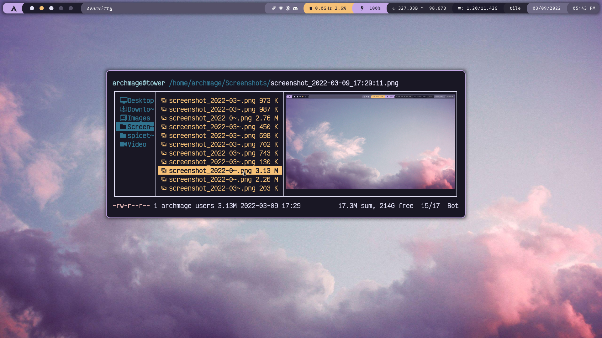
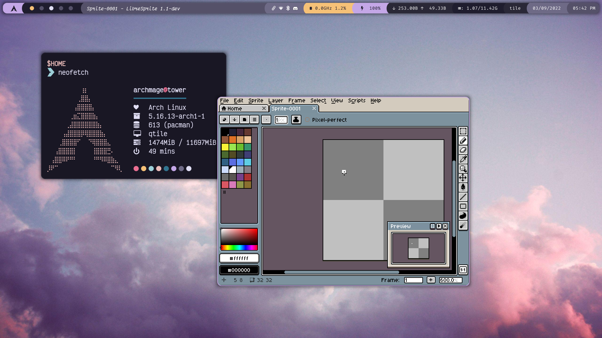

# rosé pine dots
qtile dots for my laptop, using the rosé pine color scheme

# previews

# packages

either do ``sudo pacman -S $(cat paclist)`` or run install.sh

# additional files

install the following gtk theme systemwide (usr/share/themes)
[rosé pine gtk](https://github.com/rose-pine/gtk)
(or just do install.sh)

slack theme:
[slack](https://github.com/rose-pine/slack)
