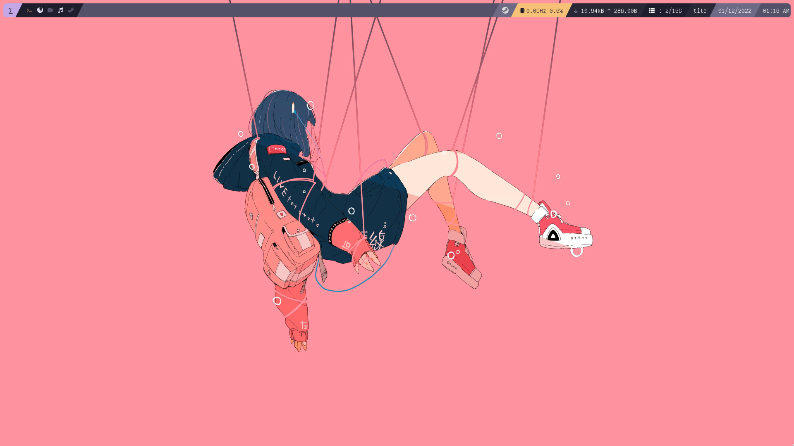
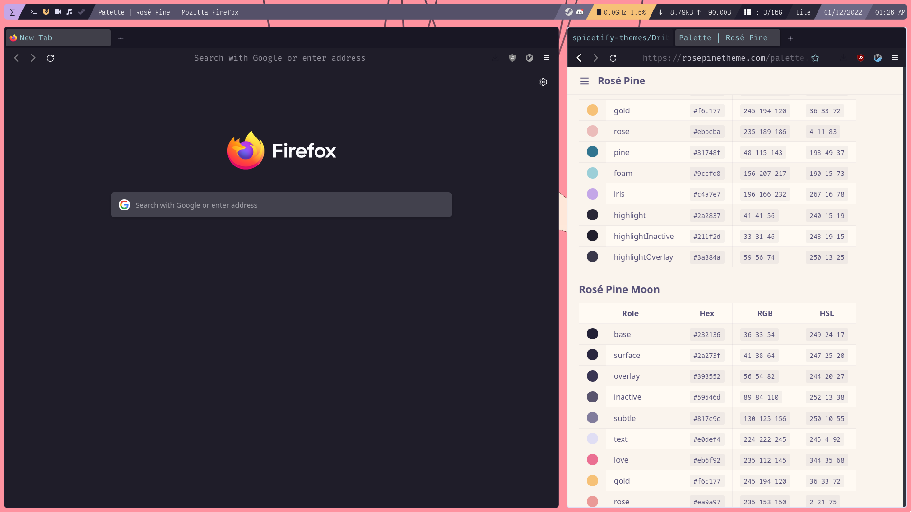
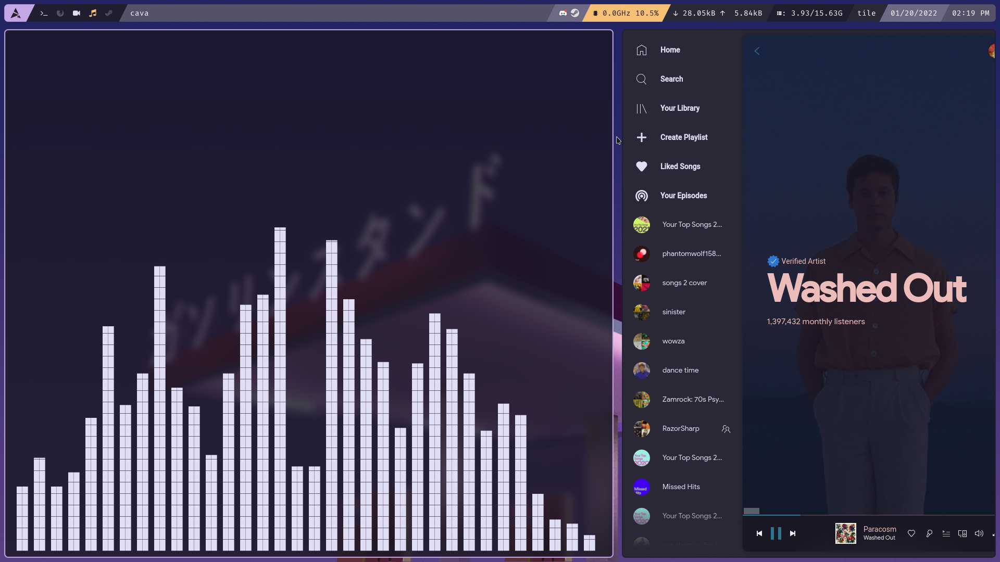
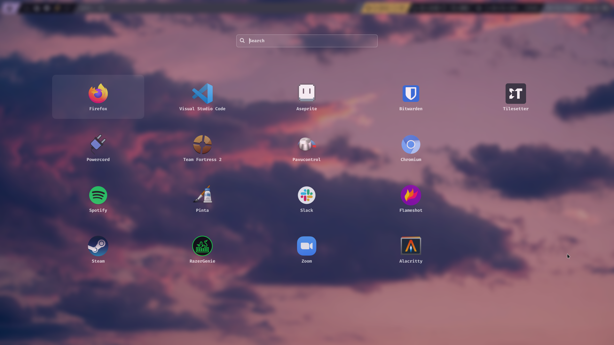
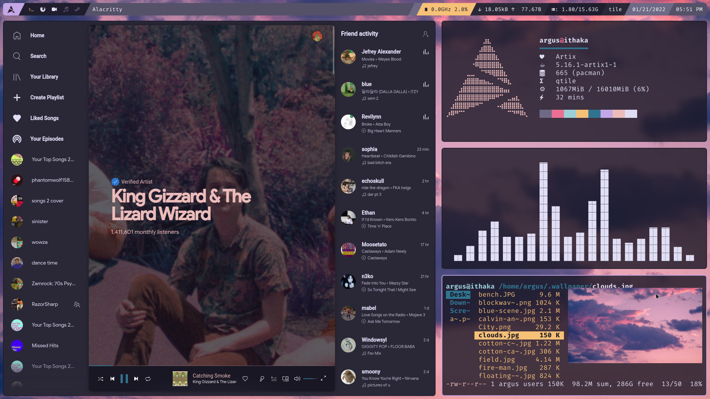
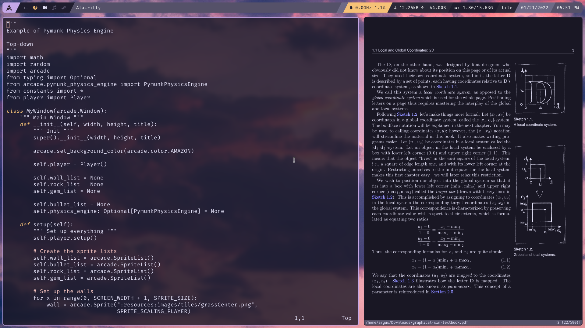
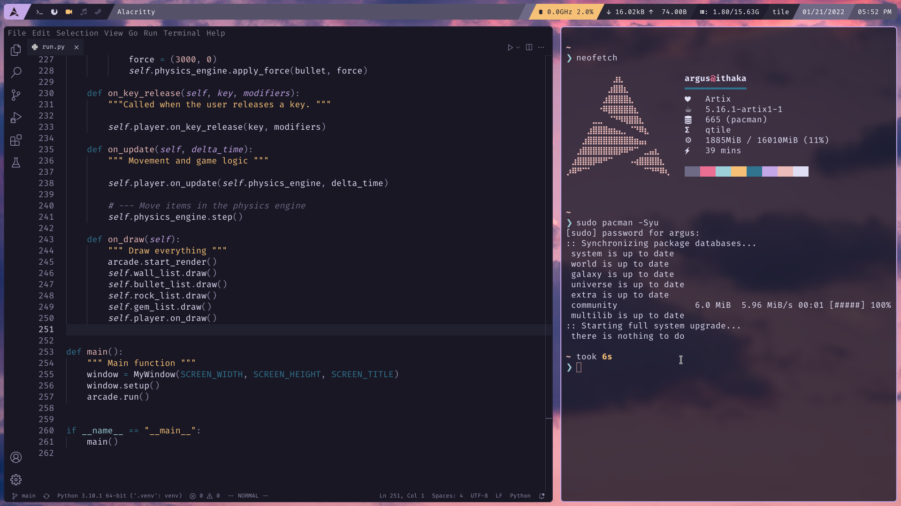

# rosé pine dots
qtile dots for my desktop pc, using the rosé pine color scheme

# previews

# packages
install the following packages on arch/artix to get everything working:

alacritty
capitaine-cursors
dunst
firefox
i3lock-fancy-git
lightdm
lightdm-gtk-greeter
lightdm-mini-greeter
neofetch
nerd-fonts-victor-mono
otf-nerd-fonts-fira-code
picom-ibhagwan-git
psutils
python-ueberzug-git
qtile-git
ranger-git
rofi
starship
spotify
spicetify-cli
tmatrix-git
vim
xautolock
xmousepasteblock-git
zathura
zathura-pdf-poppler

# additional files

install the following gtk theme systemwide (usr/share/themes)
[rosé pine gtk](https://github.com/rose-pine/gtk)

slack theme:
[slack](https://github.com/rose-pine/slack)
